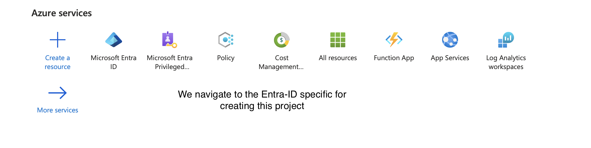
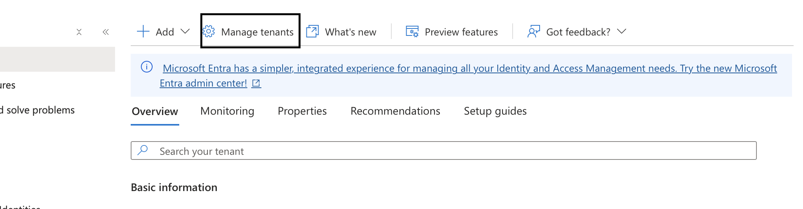
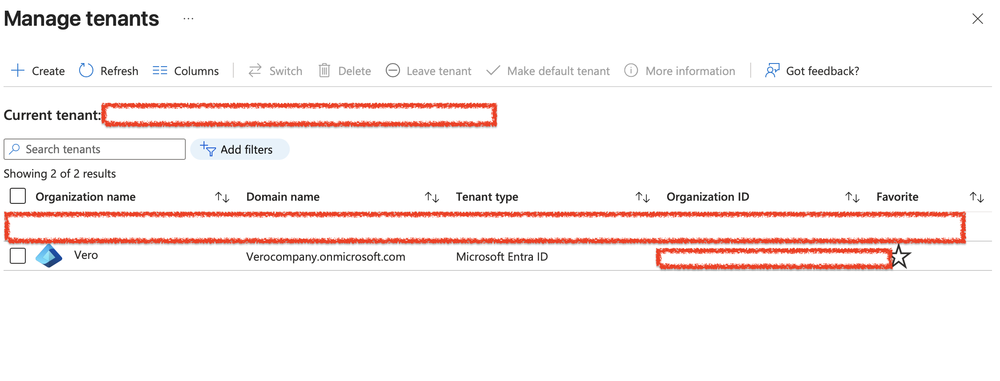

# 🐶 Creating Tenants For the New Organization

## In this Lab i created a Tenant called Vero. Vero will serve as the New Company Tenant which i will be performing most of the activities.

### Firstly i navigated to the Azure Platform
 

## Then i navigated to manage Tenants
 

## The Company Tenant Vero is created

