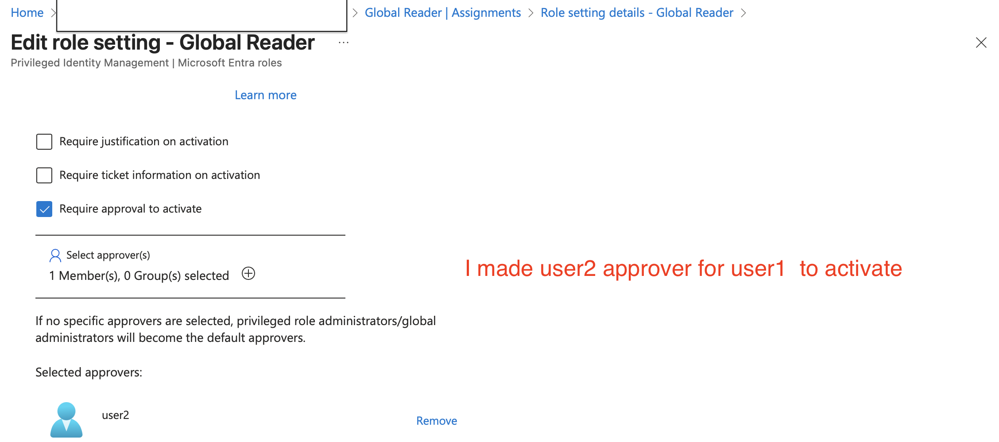
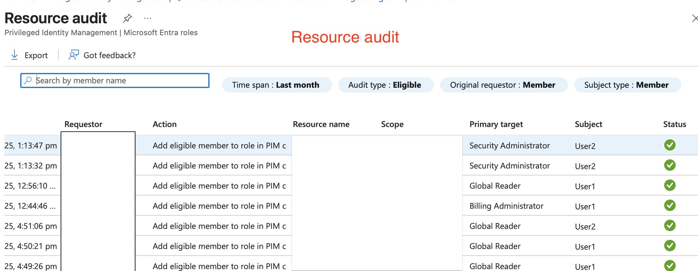

---
LAB:
    Title: 'Microsoft Entra Privileged Identity Management'
    To do: 'Manage Identity and Access'
---

## Scenario

I will create a proof of concept that uses Microsoft Entra Privileged Identity Management (PIM) to enable just-in-time administration and control the number of users who can perform privileged operations. 
The specific requirements are:

- Create a permanent assignment of the  Microsoft Entra ID user to the Security Administrator role. 
- Configure the  Microsoft Entra ID user to be eligible for the Billing Administrator and Global Reader roles.
- Configure the Global Reader role activation to require an approval of the  Microsoft Entra ID user
- Configure an access review of the Global Reader role and review auditing capabilities.

### Create a permanent assignment of the  Microsoft Entra ID user to the Security Administrator role.

#### Firstly i made a user eligible for a role ( Billing administrator role)
> Here i made User1 the Billing admin and ensured Authentication

> 

### Configuring a role to require approval to activate and add an eligible member
> Here i ensured User2  is the approver for User1 as the Global reader
> and i made User1 the Global reader

 

 >
>

### Giving a user permanent assignment role

> Here i will make User2 a Security Admin Permanently.
>

### Creating an Access Review and reviewing the PIM auditing features

> Here i will configure Entra ID roles and also review the PIM alerts.
>

 #### Creating an Access review

#### Viewing audit logs that involves the User1

#### Giving reasons to deny access

#### Viewing decisions in General Overview

### Reviewing PIM alerts, summary information, and detailed audit information

#### Reviewing PIM roles alert settings

#### Roles Overview

#### Retrieving detailed information, including Time, Requestor,
#### Action, Resource name, Scope, Primary Target and Subject.

