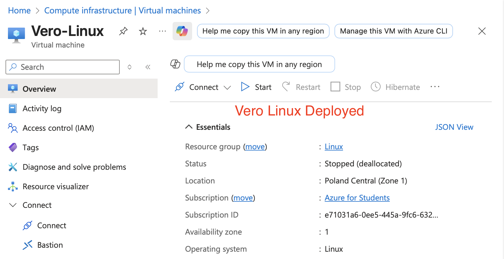
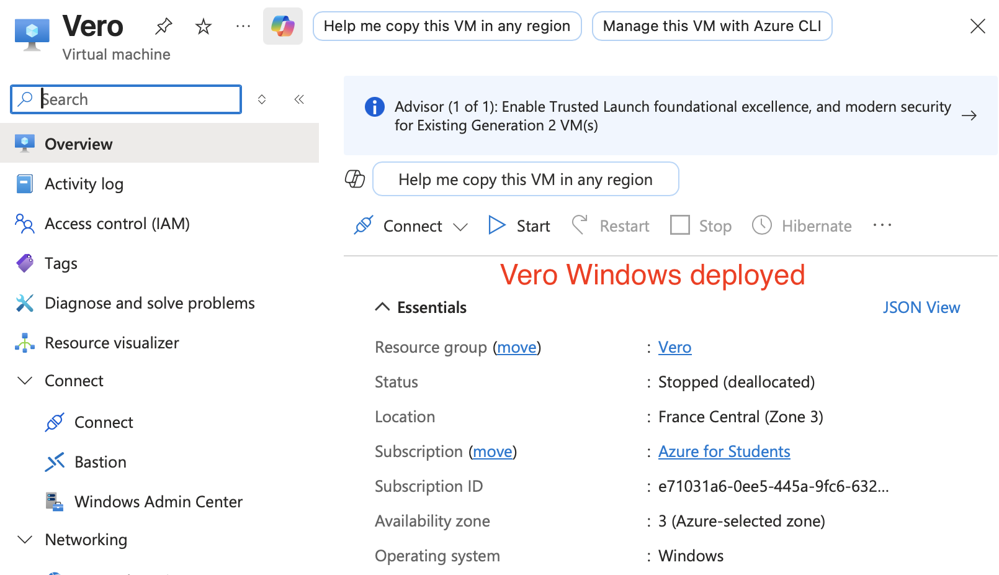

# Proof Of Concept
## I created a proof of concept for the Microsoft Entra ID Authentication
## The objectives are to evaluate the following:
### Microsoft Entra ID multi-factor authentication
### Microsoft Entra ID conditional access
### Microsoft Entra ID conditional access risk-based policies

## Lab Objectives

In this lab i did the following: 

- Deployed two Azure VM's Linux and Windows
- Implemented Azure MFA
- Implemented Microsoft Entra ID Conditional Access Policies 
- Implemented Microsoft Entra ID Identity Protection

# Deploying Vero Linux and Vero Windows Virtual Machines

#### Linux Deployment

### After careful deployment process i can now SSH into my Vero Linux and Vero Windows
> This is because i activated the ssh port 22. The rdp port is also active for Windows

#### Windows Deployment
> I also deployed Windows VM for Vero

Linux SSH Confirmed 

Windows SSH confirmed

