# Proof Of Concept
## I created a proof of concept for the Microsoft Entra ID Authentication
## The objectives are to evaluate the following:
### Microsoft Entra ID multi-factor authentication
### Microsoft Entra ID conditional access
### Microsoft Entra ID conditional access risk-based policies

## Lab Objectives

In this lab i did the following: 

- Deployed two Azure VM's Linux and Windows
- Implemented Azure MFA
- Implemented Microsoft Entra ID Conditional Access Policies 
- Implemented Microsoft Entra ID Identity Protection

# Deploying Vero Linux and Vero Windows Virtual Machines

#### Linux Deployment

### After careful deployment process i can now SSH into my Vero Linux and Vero Windows

> This is because i activated the ssh port 22. The rdp port is also active for Windows
>

#### Windows Deployment

> I also deployed Windows VM for Vero

## Linux SSH Confirmed 

## Windows SSH confirmed

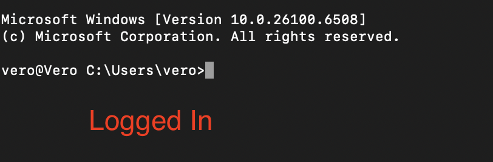

# Implementing  Azure MFA

##### It is very important to note that in Vero Company there are 6 on-site Employees excluding the IT, 2 Managers and 1 Central Manager. 
##### The IT-department will manage and secure all employees and Managers.

##### In the IT-department there is just 1 employee managing the infrastructure of the company.
Total number of employees= 10. 6 employees, 2 manager, 1 central manager, 1 IT employee.

## Creating Users and Groups since we already created a Tenant

#### I created a User central group and managers central group.
#### In the Users central group there are 6 employees. 
#### In the Managers central group there are 2 Managers.

##### The user central group is controlled by the two Managers.

##### The Central manager has control over the Managers central group.
##### The IT department has control over all groups and users.

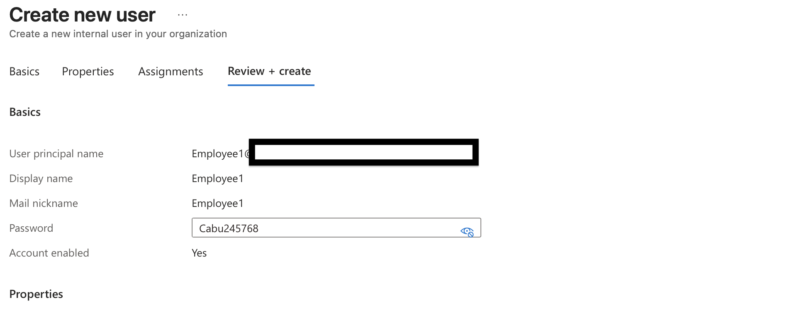

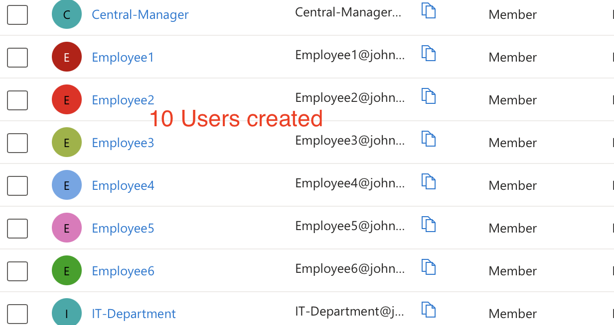

##### The user central group is controlled by the two Managers.

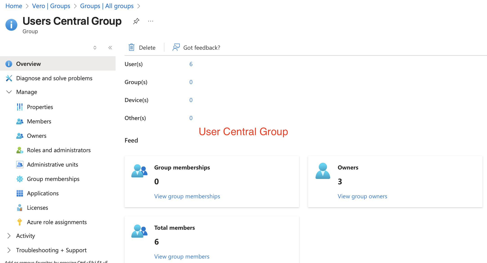

#### In the Managers central group there are 2 Managers.

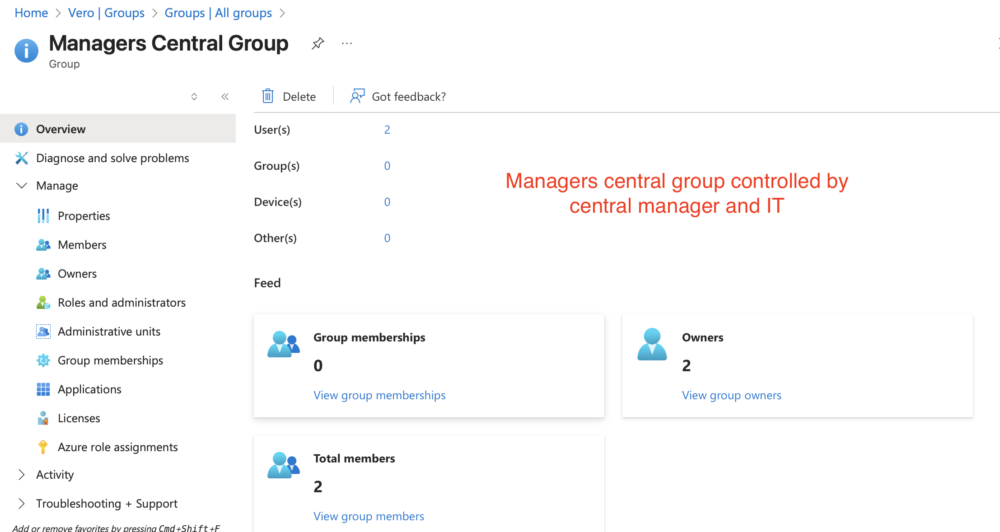

#### The Central manager has control over the Managers central group.

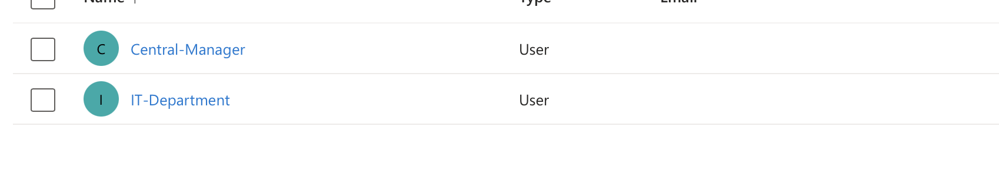

# Configuring Azure MFA 

###  Selecting the Authentication Method

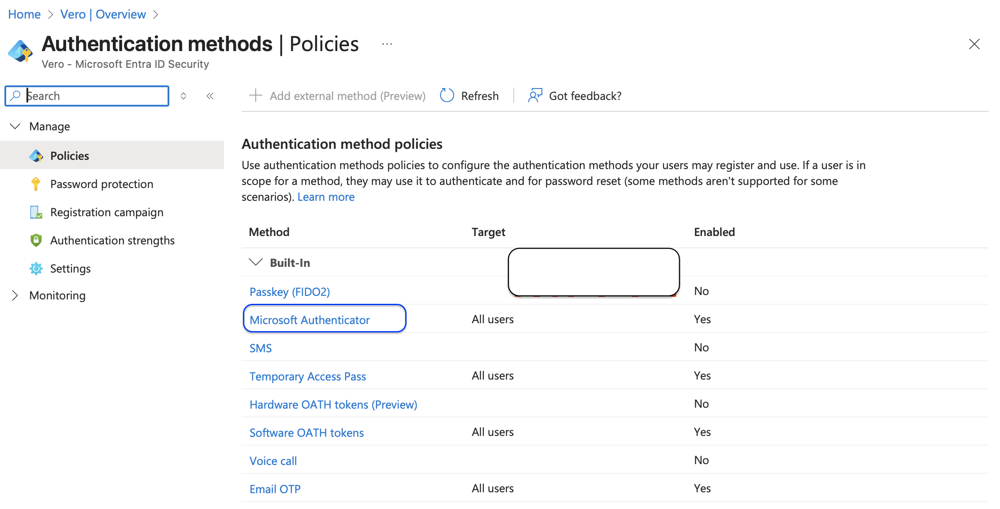

### Setup to target all users

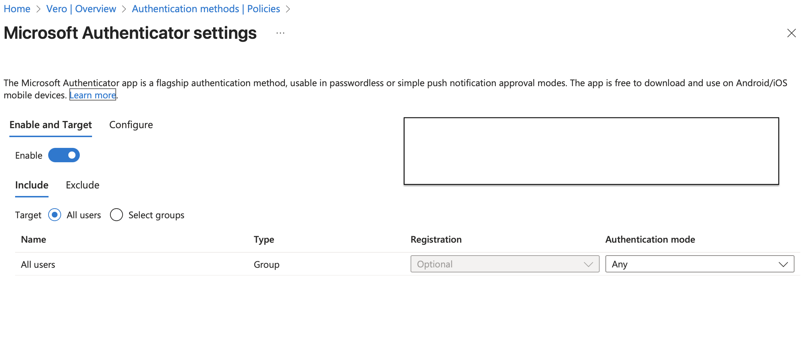

### Including OTP 

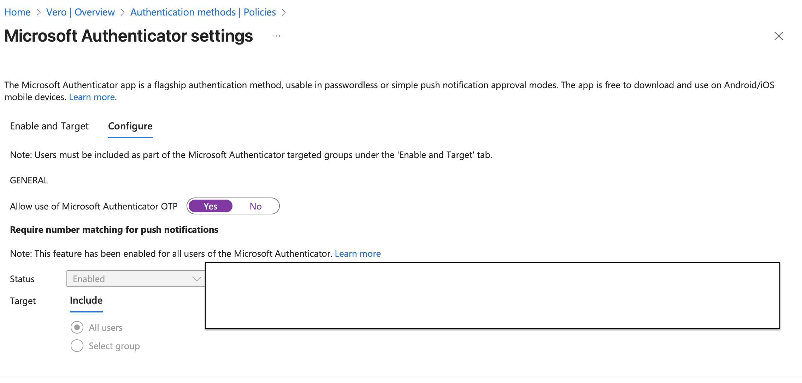

# Implement Microsoft Entra ID Conditional Access Policies

#### Creating policy for users 

##### Step By Step Guide.

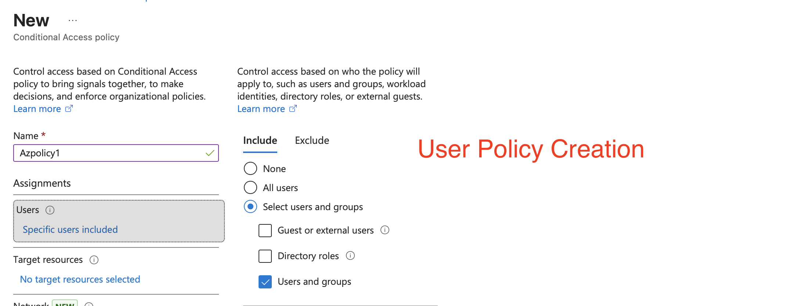

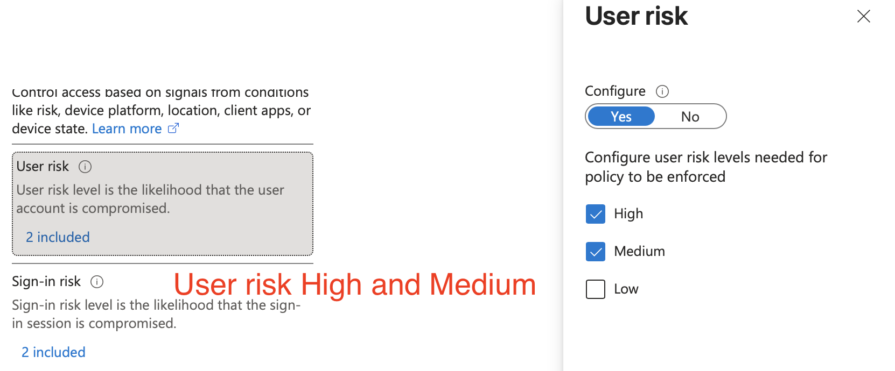

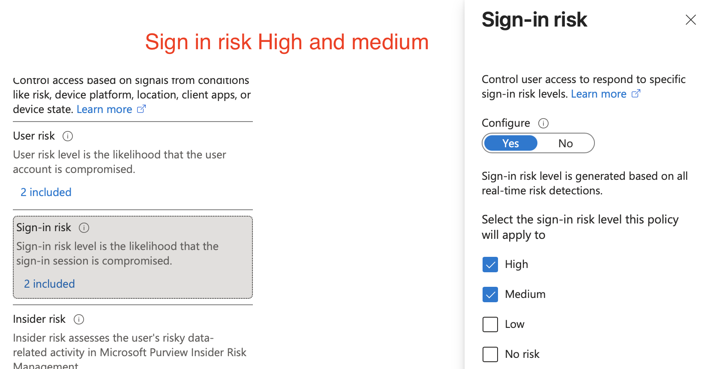

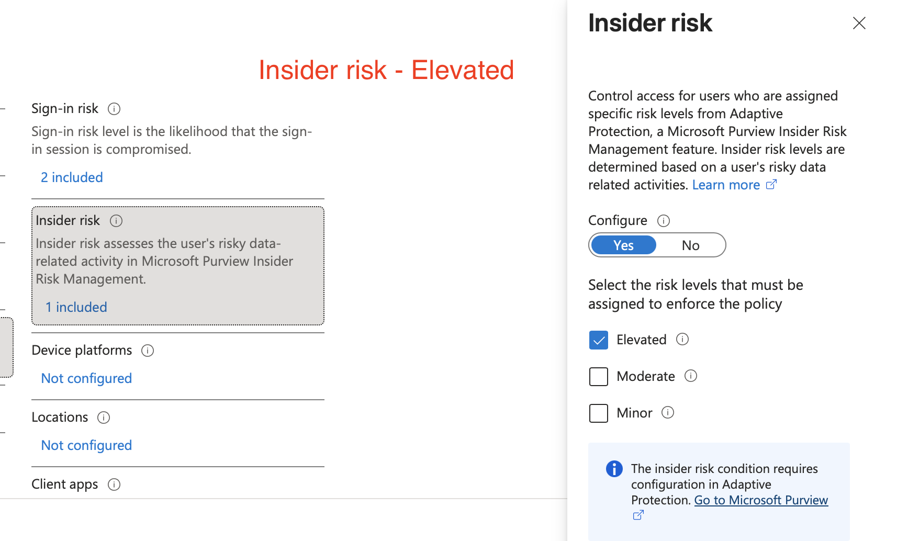

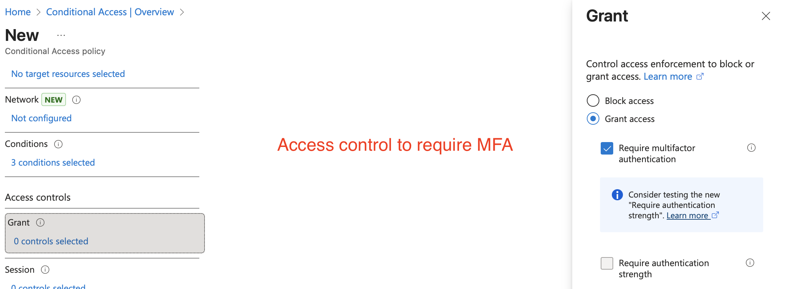

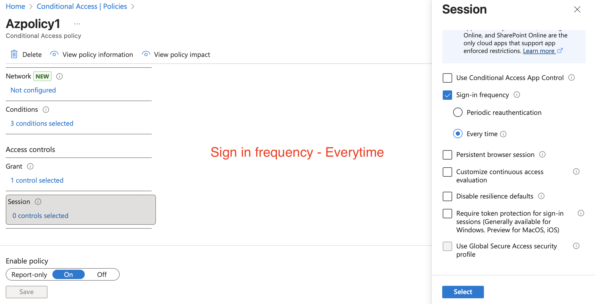

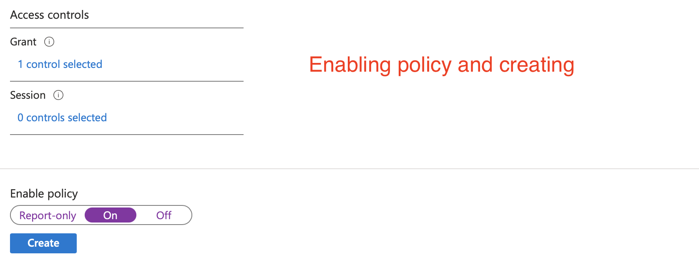

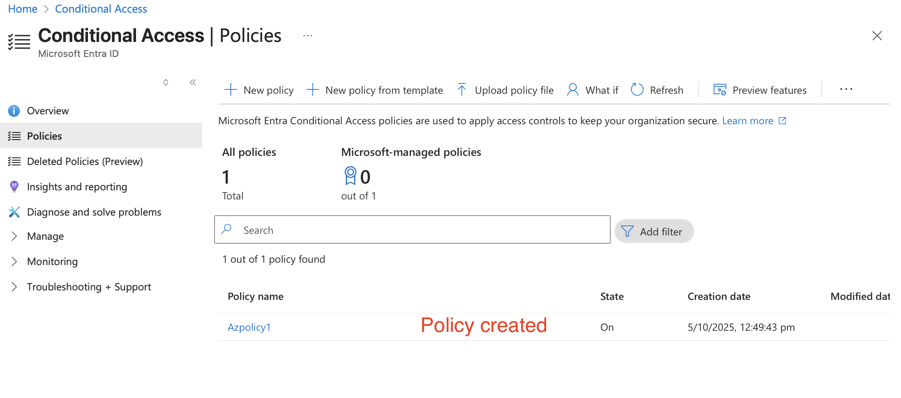

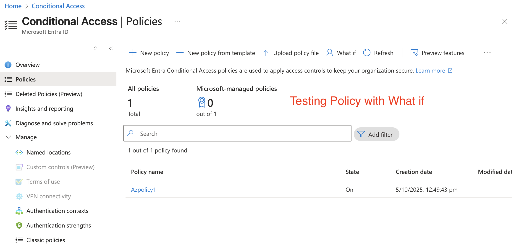

